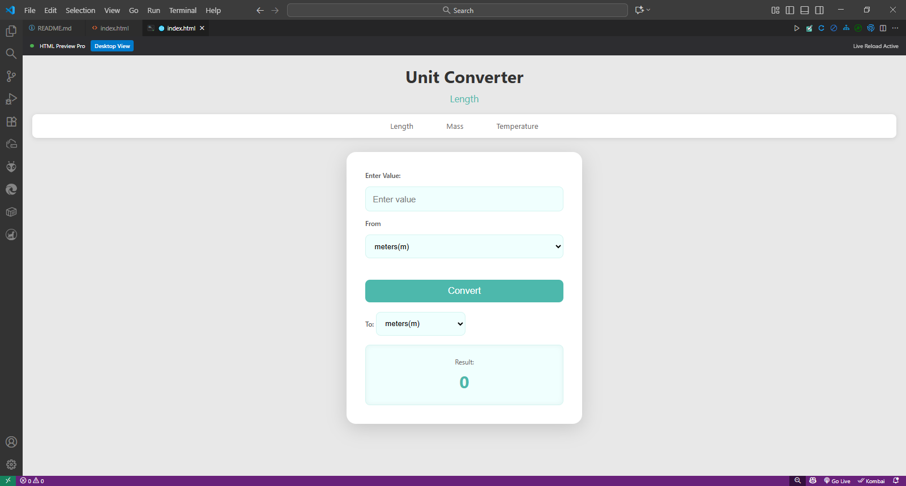

# 📏 Unit Converter

A simple and clean web-based unit converter for converting between different units of length, mass, and temperature.

## ✨ Features

- *Length Conversion*: Convert between meters, kilometers, miles, feet, inches, yards, centimeters, millimeters, and nautical miles
- *Mass Conversion*: Convert between kilograms, grams, pounds, ounces, and tons
- *Temperature Conversion*: Convert between Celsius, Fahrenheit, and Kelvin
- *Real-time Conversion*: Results update as you type
- *Clean UI*: Modern, responsive design with teal/mint color scheme
- *Mobile Friendly*: Works perfectly on all devices

## 🚀 Demo

[Live Demo]() (Add your link after deployment)

## 📸 Screenshot

 (Add a screenshot)

## 🛠 Technologies Used

- HTML5
- CSS3
- JavaScript (Vanilla)

## 💻 How to Use

1. Select the unit you want to convert *from*
2. Enter the value you want to convert
3. Select the unit you want to convert *to*
4. Click "Convert" or watch it auto-convert!
5. View your result instantly

## 📦 Installation

### Option 1: Download and Run Locally

1. Clone this repository:
```bash
git clone https://github.com/eugene234466/unit-converter.git
Navigate to the project folder:
cd unit-converter
Open index.html in your browser